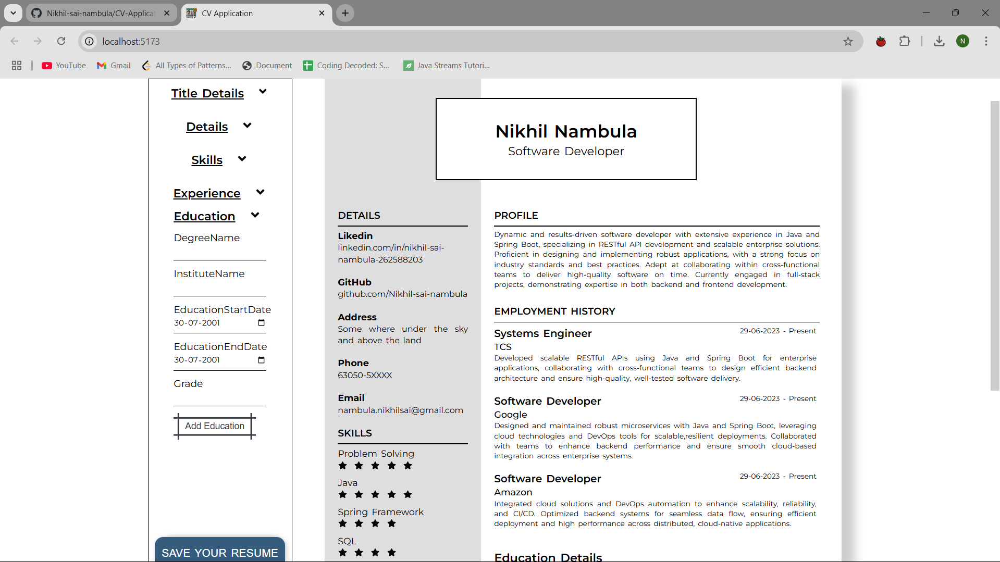

# CV-Application

This resume website features a clean and responsive design, allowing users to easily navigate through different sections, including my work experience, education, technical skills, and personal projects. Utilizing React's component-based architecture, the website ensures optimal performance making it an ideal platform to present my qualifications to potential employers. The integration of dynamic features enhances user engagement and provides a comprehensive view of my capabilities in a visually appealing format.

